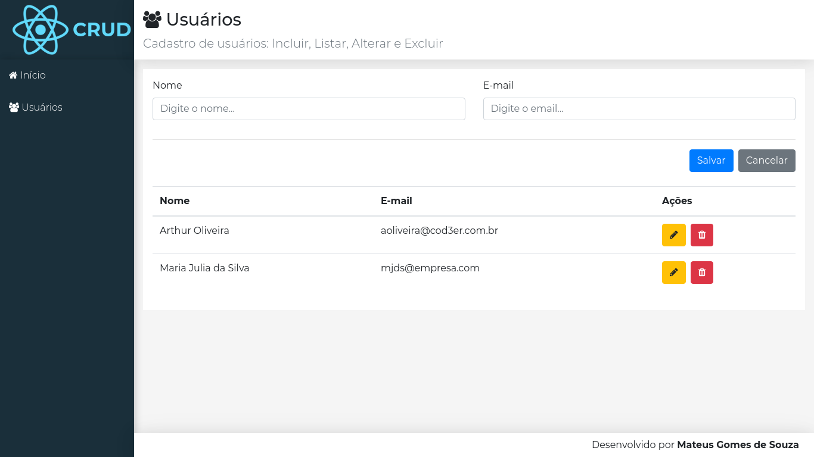

<h1 alight="center">CRUD de Usuário com React</h1>

<p>Projeto de CRUD de usuário feito em React durante o curso de Web Moderno com o professor Leonardo Moura Leitão.</p>

## Tecnologias

As seguintes ferramentas foram tilizadas na construção do projeto:


## Screen Shot



## Como rodar a aplicação

Para o download do projeto, siga as instruções abaixo:

```
1. git clone https://github.com/mateusgs29/crud-react.git
2. cd crud-react
```

instalar as dependências e iniciar a parte do backend:

```
1. cd backend
2. npm install
3. npm start
```

instalar as dependências e iniciar a parte do frontend:

```
1. cd frontend
2. npm install
3. npm start
```